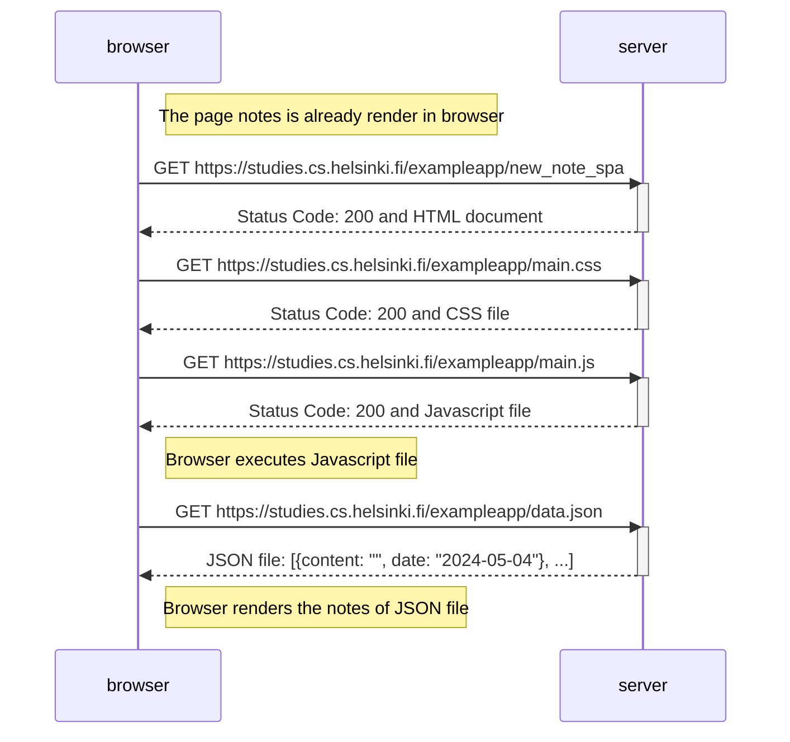

```mermaid

sequenceDiagram
    participant browser
    participant server

    Note right of browser: The page notes is already render in browser

    browser->>server: GET https://studies.cs.helsinki.fi/exampleapp/new_note_spa
    activate server
    server-->>browser: Status Code: 200 and HTML document
    deactivate server

    browser->>server: GET https://studies.cs.helsinki.fi/exampleapp/main.css
    activate server
    server-->>browser: Status Code: 200 and CSS file
    deactivate server

    browser->>server: GET https://studies.cs.helsinki.fi/exampleapp/main.js
    activate server
    server-->>browser: Status Code: 200 and Javascript file
    deactivate server

    Note right of browser: Browser executes Javascript file

    browser->>server: GET https://studies.cs.helsinki.fi/exampleapp/data.json
    activate server
    server-->>browser: JSON file: [{content: "", date: "2024-05-04"}, ...]
    deactivate server

    Note right of browser: Browser renders the notes of JSON file
```
